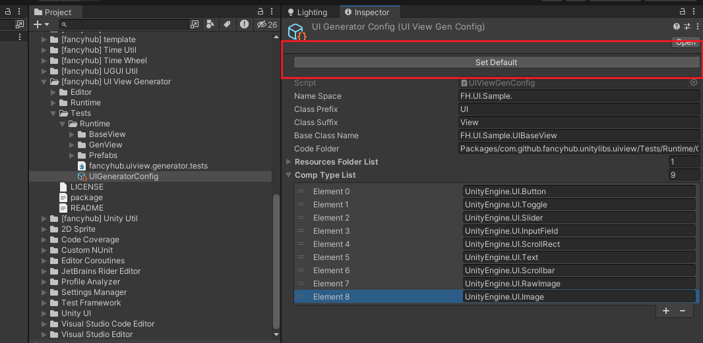
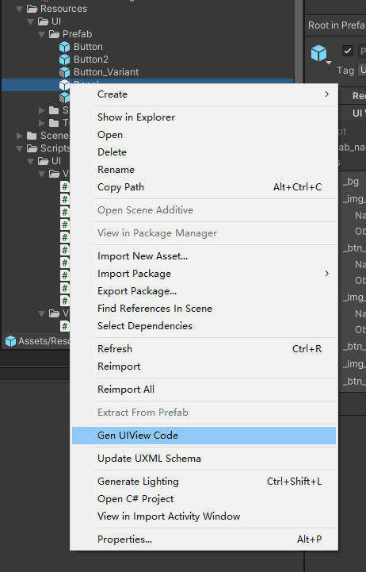
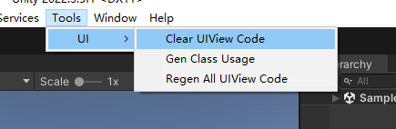
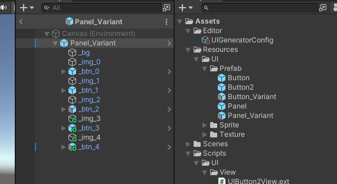

# UI View Code Generator

自动生成UI View的代码  
支持 Variant, 支持 Sub Prefab  

理论上支持任何UI框架  

UPM:  https://github.com/fancyhub/UnityLibs.git?path=/UnityLibs/Packages/com.github.fancyhub.unitylibs.uiviewgen

## Config 
你可以复制该配置, 移动到你自己喜欢的位置, 然后点击 Set Default 按钮  



## 生成代码
右击 Prefab, 选中 Gen UIView Code  



## 其他按钮

1. Clear UIView Code: 清除代码  
2. Gen Class Usage: 生成View代码之间的引用关系  
3. Regen All UIView Code: 重新生成所有代码  


## 代码样式


你自己需要实现的基类,名字可以自己取, Sample里面有样例, 可以 照抄  
```csharp
public abstract partial class UIBaseView
{
    #region Need Implement
    protected T _CreateSub<T>(GameObject obj_self) where T : UIBaseView, new() { return null; }
    protected UIViewReference _FindViewReference(string prefab_name){return null;}
    public void Destroy() { }
    #endregion


    #region Don't Need Impeplemnt
    public virtual string GetAssetPath() { return null; }
    public virtual string GetResoucePath() { return null; }
    public virtual string GetDebugName() { return this.GetType().Name; }
    protected virtual void _AutoInit() { }
    protected virtual void _AutoDestroy() { }
    #endregion
}
```

生成出来的代码  
```csharp
//UIButtonView.res.cs
public partial class UIButtonView : FH.UI.UIBaseView
{
    public  const string C_AssetPath = "Assets/Resources/UI/Prefab/Button.prefab";
    public  const string C_ResoucePath = "UI/Prefab/Button";

    public UnityEngine.UI.Button _Button;
    public UnityEngine.UI.Text _Text;

    #region AutoGen 1
    public override string GetAssetPath() { return C_AssetPath; }
    public override string GetResoucePath() { return C_ResoucePath; }

    protected override void _AutoInit()
    {
        base._AutoInit();
        UIViewReference refs = _FindViewReference("Button");
        if (refs == null)
            return;

        _Button = refs.GetComp<UnityEngine.UI.Button>("_Button");
        _Text = refs.GetComp<UnityEngine.UI.Text>("_Text");

    }

    protected override void _AutoDestroy()
    {
        base._AutoDestroy();


    }


    #endregion
}

//UIButtonVariantView.res.cs
public partial class UIButtonVariantView : UIButtonView
{
    public  new  const string C_AssetPath = "Assets/Resources/UI/Prefab/Button_Variant.prefab";
    public  new  const string C_ResoucePath = "UI/Prefab/Button_Variant";


    #region AutoGen 1
    public override string GetAssetPath() { return C_AssetPath; }
    public override string GetResoucePath() { return C_ResoucePath; }

    protected override void _AutoInit()
    {
        base._AutoInit();
        UIViewReference refs = _FindViewReference("Button_Variant");
        if (refs == null)
            return;


    }

    protected override void _AutoDestroy()
    {
        base._AutoDestroy();


    }


    #endregion
}

//UIPanelView.res.cs
public partial class UIPanelView : FH.UI.UIBaseView
{
    public const string C_AssetPath = "Assets/Resources/UI/Prefab/Panel.prefab";
    public const string C_ResoucePath = "UI/Prefab/Panel";

    public UnityEngine.UI.Image _bg;
    public UnityEngine.UI.Image _img_0;
    public UIButtonView _btn_0;
    public UnityEngine.UI.Image _img_1;
    public UIButtonView _btn_1;
    public UnityEngine.UI.Image _img_2;
    public UIButtonVariantView _btn_2;
    public List<UnityEngine.UI.Image> _img_list = new List<UnityEngine.UI.Image>();
    public List<UIButtonView> _btn_list = new List<UIButtonView>();

    #region AutoGen 1
    public override string GetAssetPath() { return C_AssetPath; }
    public override string GetResoucePath() { return C_ResoucePath; }

    protected override void _AutoInit()
    {
        base._AutoInit();
        UIViewReference refs = _FindViewReference("Panel");
        if (refs == null)
            return;

        _bg = refs.GetComp<UnityEngine.UI.Image>("_bg");
        _img_0 = refs.GetComp<UnityEngine.UI.Image>("_img_0");
        _btn_0 = _CreateSub<UIButtonView>(refs.GetObj("_btn_0"));
        _img_1 = refs.GetComp<UnityEngine.UI.Image>("_img_1");
        _btn_1 = _CreateSub<UIButtonView>(refs.GetObj("_btn_1"));
        _img_2 = refs.GetComp<UnityEngine.UI.Image>("_img_2");
        _btn_2 = _CreateSub<UIButtonVariantView>(refs.GetObj("_btn_2"));
        _img_list.Add(_img_0);
        _img_list.Add(_img_1);
        _img_list.Add(_img_2);
        _btn_list.Add(_btn_0);
        _btn_list.Add(_btn_1);
        _btn_list.Add(_btn_2);

    }

    protected override void _AutoDestroy()
    {
        base._AutoDestroy();

        _btn_0.Destroy();
        _btn_1.Destroy();
        _btn_2.Destroy();
        _img_list.Clear();
        _btn_list.Clear();

    }


    #endregion
}
 
//UIPanelVariantView.res.cs
public partial class UIPanelVariantView : UIPanelView
{
    public new const string C_AssetPath = "Assets/Resources/UI/Prefab/Panel_Variant.prefab";
    public new const string C_ResoucePath = "UI/Prefab/Panel_Variant";

    public UnityEngine.UI.Image _img_3;
    public UIButton2View _btn_3;
    public UnityEngine.UI.Image _img_4;
    public UIButtonVariantView _btn_4;

    #region AutoGen 1
    public override string GetAssetPath() { return C_AssetPath; }
    public override string GetResoucePath() { return C_ResoucePath; }

    protected override void _AutoInit()
    {
        base._AutoInit();
        UIViewReference refs = _FindViewReference("Panel_Variant");
        if (refs == null)
            return;

        _img_3 = refs.GetComp<UnityEngine.UI.Image>("_img_3");
        _btn_3 = _CreateSub<UIButton2View>(refs.GetObj("_btn_3"));
        _img_4 = refs.GetComp<UnityEngine.UI.Image>("_img_4");
        _btn_4 = _CreateSub<UIButtonVariantView>(refs.GetObj("_btn_4"));
        _img_list.Add(_img_3);
        _img_list.Add(_img_4);
        _btn_list.Add(_btn_4);
    }

    protected override void _AutoDestroy()
    {
        base._AutoDestroy();

        _btn_3.Destroy();
        _btn_4.Destroy();
        _img_list.Clear();
        _btn_list.Clear();
    }

    #endregion
}
```

